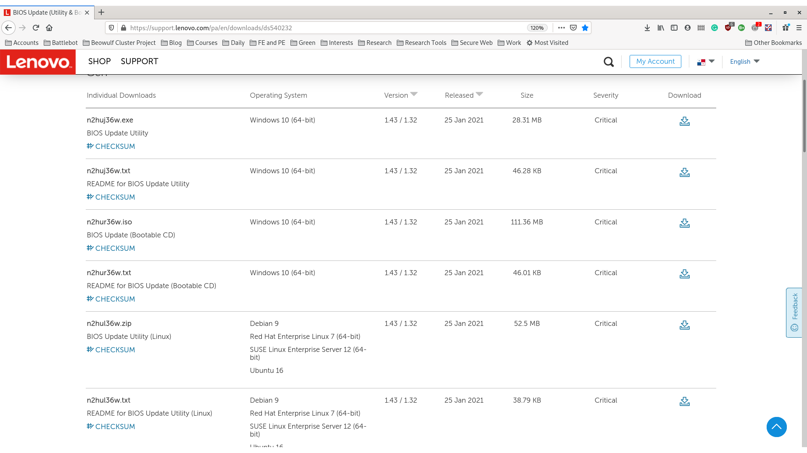
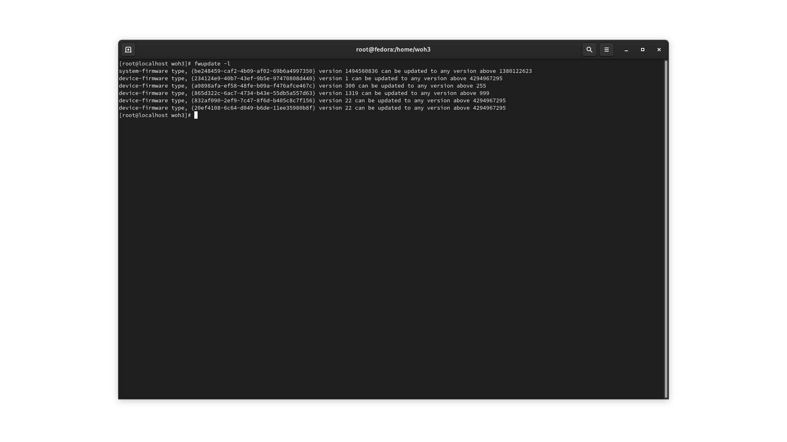
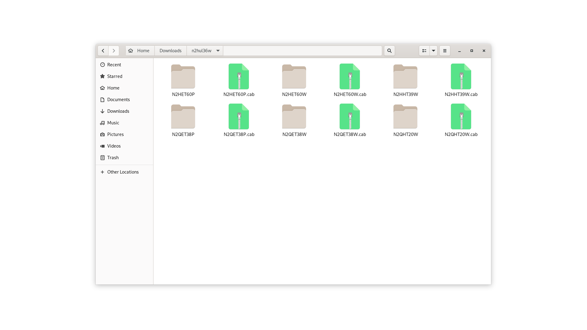

This post contains the instructions for updating the bios on a lenovo ideapad 3 using only linux and the tool 'fwupdate' which is available in Ubuntu, Fedora/RHEL and Debian.
I had quite a difficult time finding an image source but aftyer weeks of trying I finally found this page...<a href="https://support.lenovo.com/pa/en/downloads/ds540232 ">https://support.lenovo.com/pa/en/downloads/ds540232 </a>that has the files 
needed for the linux utility. This page will let you search for your lenovo product by serial number and then show the available bios update files for windows and linux.  
 
Under lenovo's system the bios updates come in .cap or capsule files that are contained in a zipped folder, you will need this file and the firmware.bin file as well as your system GUID to make this work.
if you have not installed fwupdate then please do, usually on ubuntu it is  
<pre>apt install fwupdate</pre> 
 or on Fedora/RHEL  
 <pre>dnf install fwupdate</pre> 
 If you need your system serial number you can find it with t he command...
<pre>sudo dmidecode -t system</pre>  
To find you system GUID you will need to run the command:
<pre>fwupdate -l</pre> 
 
it will give you back some long hex ID numbers (if your system is supported) and you will need this GUID to execute the command. Associated with each page of bios update fgiles is a readme file at the
bottom, be sure to read it.  
I downloaded the bios update file and extracted it,   
 

For my system it says the bios update file I need is N2HET60W file, so I open a terminal and navigate to that folder which contains a file named firmware.bin and an xml file with info. Once in that
directory and having obtained the GUID i needed I can execute the command:
<pre>fwupdate -a GUID firmware.bin</pre> 
if it is succesful then you won't get any errors and the fwupdate command will simply finish and return the bash prompt to you. And Voila! you have updated your bios in linux for a lenovo machine. 

 
