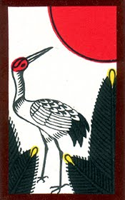

Now my interests are blending together. I have made the Hanafuda Crane into a Mandelbrot Fractal. I love how beautiful the card is. 
Here is the fractal:  
  
and here is the original card image: 
 
I found a great online tool to accomplish this <a href="http://www.malinc.se/m/ImageFractals.php">here</a>.

 
