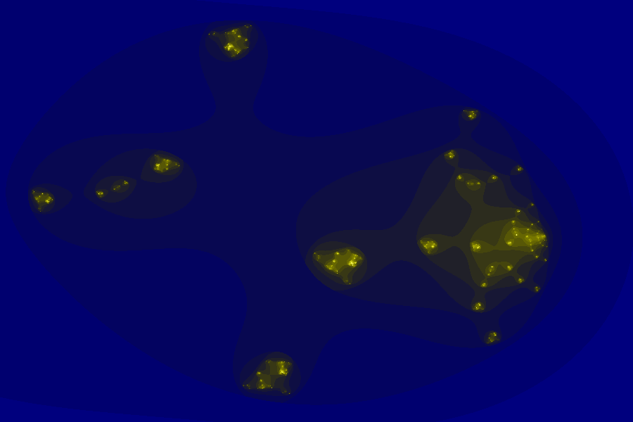
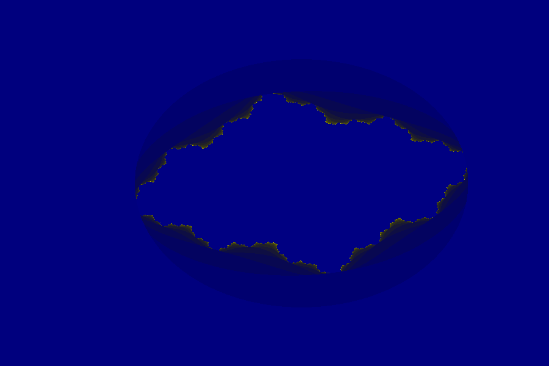
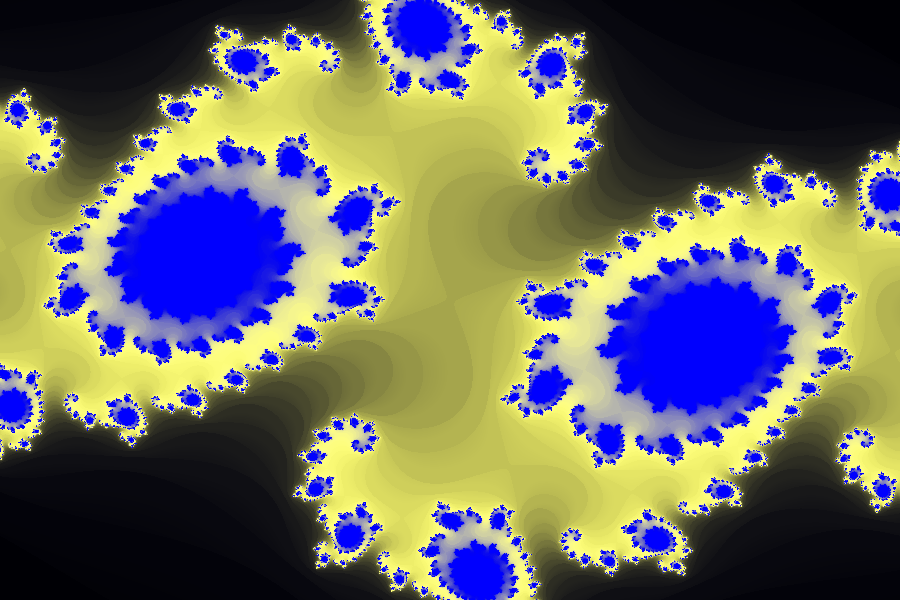

Here are a few more fractal experiments. The first is called the Man-o'war fractal:  
  
...and the next one is the Lambda Fractal:  
  
and on this one I played around with some of the colors and paramters of the Julia Set.  

 
