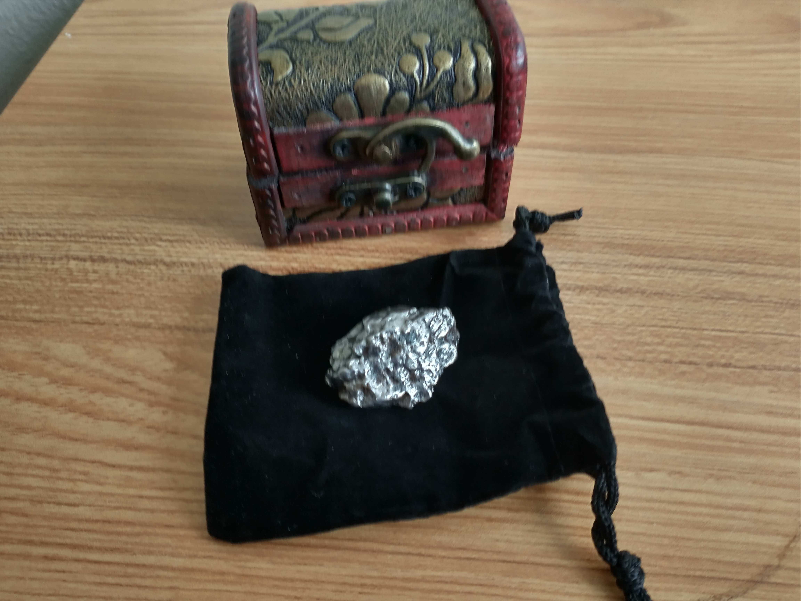
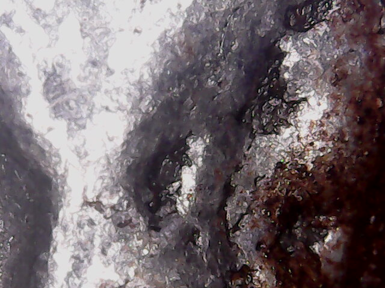
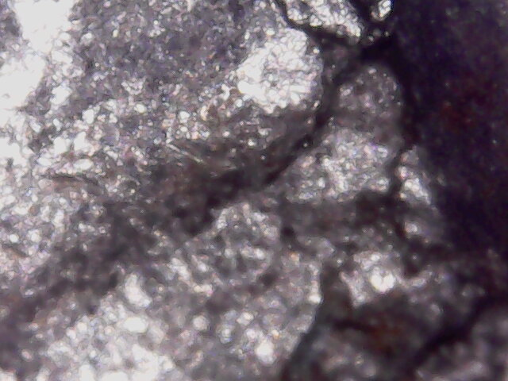
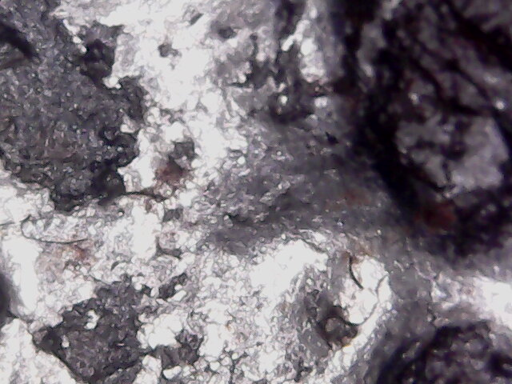
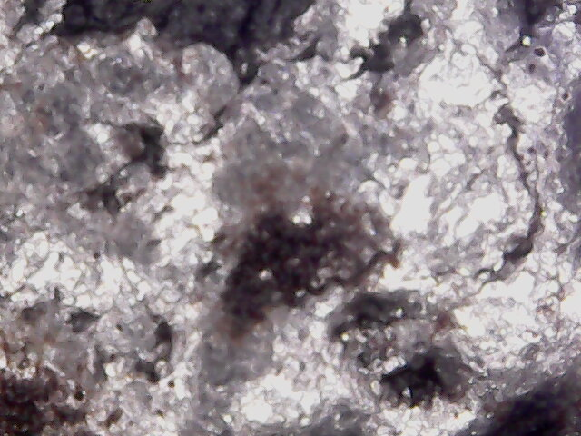
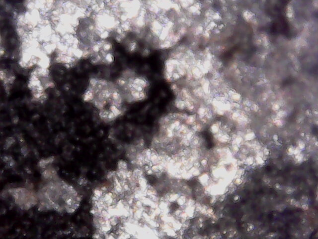

For Christmas this year I got a digital camera that I plan to use for bird-watching and then I hot a genuine
meteorite. I took some pictures and close up scans w/ my digital microscope. 
 

 

 

 

 

 

 

