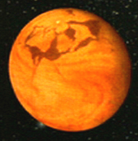

Some thoughts:

	I recently had a transformative experience. It relates to my mother in some ways. When I was about 11 I had to run away from home. I had to make a hard decision about self preservation, but I never fealt so guilty in my entire life in that decision about abandoning my mother and four brother to the clutches of that violent man-child. 
	flash-forward 40 years. I have graduated University. I have had a decade of financial and emotional security unlike anything I have ever experienced in my life. I escaped the foster care system, and the destiny that was dictated for me by statistics, but I am still under treatment for PTSD and Depression due to the early life physical and emotional trauma, and likely will be for the rest of my life. I am about to take a medically prescribed and and supervised course of Ketamine, the video visit doctor is finalizing the details with me and I take the pills. It is revolting and I have to take an extra dose of the anti-nausea med. After about half an hour I start to feel the effects and have to lie down and put on my blind fold and head phones with relaxing music. Only a few moments later I realize I may have taken too much, then, the blind fold doesn't matter, the music doesn't matter, time doesn't matter...and...I am literally in another dimension. 
	At first it seems like I am in a windy desert-valley on a very dark planet, but then it seems more like a sandstorm. The it occurs to me that I am on the desert world of Arrakis from the Sci-fi classic Dune.  

 
	Then, the sandstorm melts away for a moment and I see my mother, she is happy and healthy and she says the words "hello darlin' " to me. I can tell from her voice that this is the her from when she was still mentally and spiritually alive...and it is so...damn...good to see her that way again, and just like that, she is gone, and that sandstorm returns. Experiencing her fullness again and then having it ripped away so quickly simultaneously fills up my heart and breaks it again. 
	I realize that Dune was my mother's favorite Sci-fi Novel (Her Favorite Novel of All-Time was Shogun), and due to her influence, it was one of mine as well. Off in the distance I see a city. Via the magic of teleportation I am there. this must be the Capitol City of Arrakeen. Smooth sand-blasted stone walls, hundreds of meters deep in some places, with pulsing life deep within, and arid, lifeless armageddon without. 
	Then it occurs to me that I am not looking at Arrakis, or Arrakeen, that all of this is metaphor, and that I am looking at my own mind, so closed off and secluded, still so isolated and protected from the world, and that the sleeper still has not yet awakened. I awaken from my Ketamine torpor, about 2 hours have passed in the real world dimension. It takes me about an hour to recover completely. In the follow up after treatment video interview the doctor asks me my feelings on the efficacy of this treatment for depression and I tell her my feelings are simply "confused". She says it's ok to feel that way. 
	In the months that followed I have not done the treatment again, but I have thought about it. they have contacted me several times, but I if=gnore them, If I ever do go through it again it will be at about 1/8th the dose. I do think it helped though, as I am now in a mental space where I am asking myself about my life direction, and who I am. How to awaken the sleeper, how to go from a work in progress to a masterpiece. My views on god are not conventional, but in some ways I imagine him as a supreme photo editor for National Geographic, looking through his magnifying glass at cover photo submissions. I wonder what I need to do to make the cut to become a cover photo. I think that is a much better mental space to be in as I approach my 51st birthday, maybe a little late in life, but, better late than never. All in all I have to conclude that the therapy was good for me, i am not sure how or why, but it brought me to the realization that in terms of my own self actualization I am only in the process of reaching for my morning coffee.  

 

